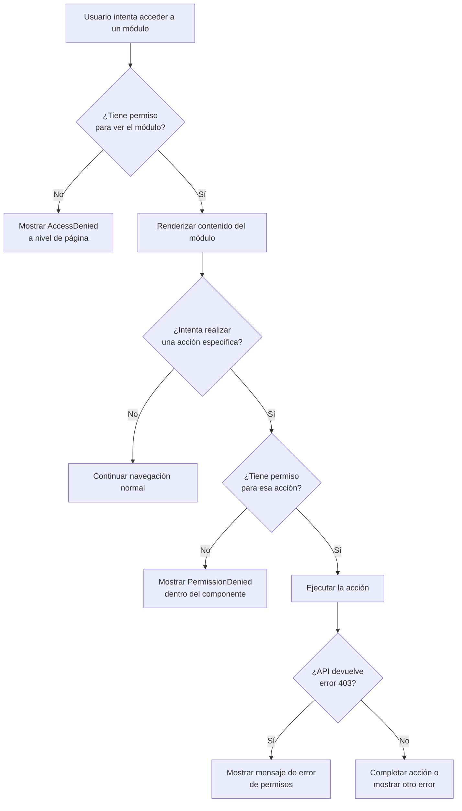

```mermaid
flowchart TD
    A[Usuario intenta acceder a un módulo] --> B{¿Tiene permiso \n para ver el módulo?}
    B -->|No| C[Mostrar AccessDenied \n a nivel de página]
    B -->|Sí| D[Renderizar contenido del módulo]
    
    D --> E{¿Intenta realizar \n una acción específica?}
    E -->|No| F[Continuar navegación normal]
    E -->|Sí| G{¿Tiene permiso \n para esa acción?}
    
    G -->|No| H[Mostrar PermissionDenied \n dentro del componente]
    G -->|Sí| I[Ejecutar la acción]
    
    I --> J{¿API devuelve \n error 403?}
    J -->|Sí| K[Mostrar mensaje de error \n de permisos]
    J -->|No| L[Completar acción o \n mostrar otro error]
```
